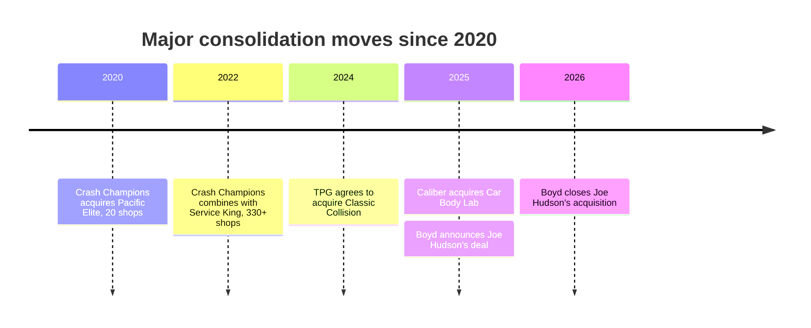

# U.S. Auto Body Repair Consolidation

## Executive Summary

Public sources point to a market that is still consolidating, but in a more selective, capital-intensive phase. Share concentration kept rising even as H1 2025 shop acquisitions and openings slowed materially, Boyd still executed a $1.3 billion Joe Hudson’s transaction that closed in January 2026, and Focus Advisors counted 14 private-equity-backed consolidators active by year-end 2025. The core logic has not changed: scale helps win insurer relationships, absorb technician scarcity, and fund ADAS, calibration, and OEM-capability investments. citeturn22view4turn19view5turn22view5turn15view0turn16view0

## Five factual claims

1. **Concentration is meaningful and still rising.** Focus Advisors estimated that the “Big 5” consolidators operated at least **4,019 locations**, representing **13.3% of U.S. shop share** and about **31.7% of U.S. revenue share** by H1 2025. citeturn22view0

2. **The pace softened before re-accelerating.** Focus Advisors said shops **acquired or opened** by consolidators and market-leading MSOs in **H1 2025 fell 35% year over year**, to **223** from **343** in H1 2024, even while concentration continued to increase. citeturn22view4

3. **The biggest recent deal was regionally concentrated.** Boyd’s acquisition of Joe Hudson’s, closed on **January 9, 2026**, added **258 locations across the U.S. Southeast** and lifted Boyd’s North American footprint **25% to 1,301**. citeturn19view5

4. **Valuations remain high for scaled assets, and financing is layered.** Boyd disclosed a **$1.3 billion** purchase price for Joe Hudson’s, equal to **13.3x adjusted EBITDA** before synergies and about **9.3x** after expected synergies; Boyd said financing would come from **committed bridge financing, revolver draws, equity financing, and new senior notes**, and later closed a **$897 million** U.S./Canada equity offering to help fund the deal. citeturn11view3turn19view6

5. **Private equity is still the main fuel.** Focus Advisors reported that **three new PE firms entered collision repair in 2025**, bringing the number of **PE-backed consolidators actively acquiring to 14** at year-end 2025. citeturn22view5

## Trend synthesis

The overall pattern is continued consolidation, but under tighter operating conditions. Scale matters because insurers increasingly want broad regional or national repair solutions, while labor and technology demands keep rising. Gerber says it is a DRP partner for many major insurers, Crash says it is trusted by nearly all major insurers, TechForce’s 2026 report shows a **57% collision-tech supply gap**, and Caliber says **65% of collision repairs required ADAS calibration by 2025 Q2**. Those forces favor sponsor-backed MSOs that can keep buying, densifying, training, and investing in diagnostics and calibration capacity. citeturn22view0turn13search10turn13search12turn15view0turn16view0

Timeline events are drawn from company history pages and official releases. citeturn19view4turn12view8turn12view7turn19view5

## Leading consolidators

| Company | Est. U.S. locations | Year founded | Notable recent acquisitions | Ownership type |
|---|---:|---:|---|---|
| Caliber citeturn12view1turn12view7turn20search7 | 1,800+ | 1997 | Car Body Lab, 2025 | Private, H&F-backed |
| Gerber / Boyd citeturn12view2turn12view3turn19view5turn19view6 | 1,000+ U.S. Gerber sites | 1937 | Joe Hudson’s, closed 2026 | Public, BGSI |
| Crash Champions citeturn19view3turn19view4turn12view9 | 650+ | 1999 | Service King, 2022; South Motors and Big Sky, 2024 | Private, founder-led and Clearlake-backed |
| Classic Collision citeturn19view0turn11view0turn12view8 | 353 | 1983 | Heat Collision, 2024; multiple 2025 add-ons | Private, TPG-owned |

## Evidence gaps and assumptions

Public disclosure is uneven. Focus explicitly says its shop-count and acquisition statistics are **best estimates** built from public information plus proprietary inputs; operator site counts are often **rounded** and may mix collision, glass, mobile, or North America totals; and very few private-company deals disclose EBITDA and financing with Boyd/Joe Hudson’s-level detail. So the direction of travel is clear, but exact national shares and private-market multiples remain approximate outside major public-company disclosures. citeturn22view5turn12view0turn12view2turn19view5turn11view3

- “Top 4” means **Caliber, Boyd/Gerber, Crash Champions, and Classic Collision**, excluding Joe Hudson’s because Boyd closed that acquisition on **January 9, 2026**. citeturn19view5
- Location counts use the **latest public figures found**; where companies say “over” or “more than,” the stated number is treated as a **lower bound**. citeturn12view0turn12view2turn19view3turn19view0
- Boyd’s **1,301** figure is **North America**, so the comparison table uses Gerber’s **1,000+ U.S.** count for U.S. comparability. citeturn12view2turn19view5