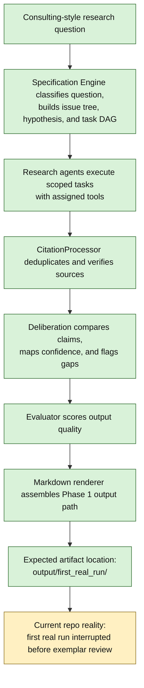
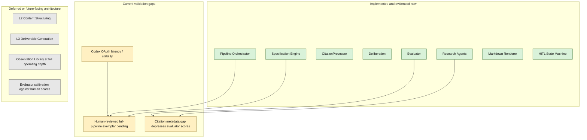

# System Diagram

> Status: support architecture diagram. Not current-state truth.
> Read `AUTHORITY-INDEX.md`, `SESSION-STANDARD.md`, and the control-plane pair first.
> Labels such as `Built`, `Pressure-tested`, `Current repo reality`, and `Implemented and evidenced now` below are derived support labels for architecture orientation only; they do not certify the checked-out worktree, live lane authorization, or present runtime truth.

## Legend

- `Built`: implemented in code and represented in the repo
- `Pressure-tested`: exercised with real-model or real-tool component tests documented in the repo
- `Planned`: part of the intended architecture, not the current meeting claim
- `In validation`: code path exists and the MVP is built, but human-reviewed exemplar output is still pending

## 1. High-Level Architecture

```mermaid
flowchart LR
    U[User / Client Question]
    L0[L0 Specification Engine<br/>Built + Pressure-tested]
    G1[HITL Gate 1<br/>Built]
    L1[L1 Research Agents<br/>Built + Pressure-tested]
    CP[CitationProcessor<br/>Built + Pressure-tested]
    L15[L1.5 Deliberation<br/>Built + Pressure-tested]
    G2[HITL Gate 2<br/>Built]
    L4[L4 Evaluator<br/>Built + Pressure-tested]
    MR[Markdown Renderer<br/>Built]
    OUT[Phase 1 Markdown Output<br/>Built path, now under validation]
    L2[L2 Content Structuring<br/>Planned / Phase 2]
    L3[L3 Deliverable Generation<br/>Planned / Phase 2]
    OBS[Observation Library / Meta-layer<br/>Planned / partial foundation]

    U --> L0 --> G1 --> L1 --> CP --> L15 --> G2 --> L4 --> MR --> OUT
    OBS -. informs improvement over time .-> L0
    OBS -. informs improvement over time .-> L4
    L15 -. future richer handoff .-> L2 --> L3

    classDef built fill:#d9f2d9,stroke:#2d6a2d,color:#111;
    classDef partial fill:#fff0c2,stroke:#8a6d1d,color:#111;
    classDef planned fill:#e7e7e7,stroke:#6b6b6b,color:#111;

    class L0,G1,L1,CP,L15,G2,L4,MR built;
    class OUT partial;
    class L2,L3,OBS planned;
```

## 2. Actual Phase 1 MVP Workflow For This Meeting

The `output/first_real_run/` path shown below refers to archived demo evidence, not to current live truth or active output canon.

## 3. Implementation Status Map

